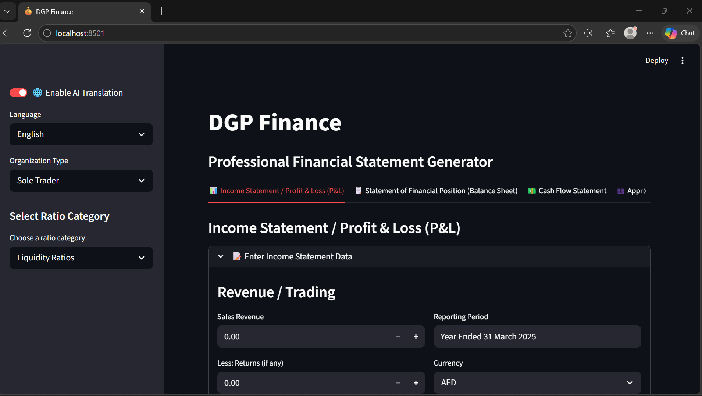

# DGP Finance — 8-Day AI Challenge Submission

> A lightweight financial statement generator for students & small businesses

---

## 🎯 Problem Solved
Manual financial reporting is time-consuming and error-prone for non-experts.  
DGP Finance simplifies this by automatically generating:

- Balance Sheet  
- Income Statement  
- Cash Flow Statement  

with built-in validation and a clean, interactive interface.

---

## ✨ Key Features
- ✅ **Lightweight & Efficient**: Runs locally with minimal dependencies  
- 🌍 **Multi-Language UI**: Supports 9 languages (English, Arabic, French, Spanish, Portuguese, Russian, German, Swahili, Mandarin)  
- 🧮 **Accurate Financial Logic**: Deterministic calculations (no hallucination risk)  
- ⚠️ **Input Validation**: Prevents accounting inconsistencies  
- 📈 **Forecasting Module**: Optional OLS-based projections (clearly separated)  
- 📘 **Built-in Glossary**: Simple explanations for financial terms  
- 💻 **Streamlit Interface**: Clean, responsive, and easy to use  

---

## 🛠️ Tech Stack
- Python 3.10+
- Streamlit (UI)
- pandas / numpy (data handling)
- scipy (OLS regression)
- Git & GitHub (version control)

---

## 📁 Project Structure
```
dgp-finance/
│── app.py              # Main Streamlit app
│── statements.py       # Financial statement logic
│── forecast.py         # Forecasting module
│── translator.py       # Language handling
│── validators.py       # Input validation
│── utils.py            # Helper functions
│── data/               # Sample data
│── requirements.txt
│── README.md
```

---

## 🚀 Quick Start
```bash
git clone https://github.com/xtoviphier/dgp-finance.git
cd dgp-finance
pip install -r requirements.txt
streamlit run app.py
```

---

## 📸 Demo (Optional but Recommended)
_Add screenshots or demo video link here_

---

## ⚠️ Disclaimer
This tool is designed for **educational and small-scale use**.  
It should not replace professional financial advice.

---

## 📌 Challenge Context
Built as part of the **8-Day AI Application Challenge** by Decoding Data Science.

---

## 🔗 Author
**Christopher William Wambua**

## 📸 Prototype
